# Git_assignment_1
Basic Git Commands

# Screenshots

### Initializing the git repository.
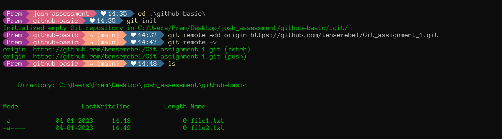

### Getting the git status as well as adding to the staging state and committing it to the repo. 
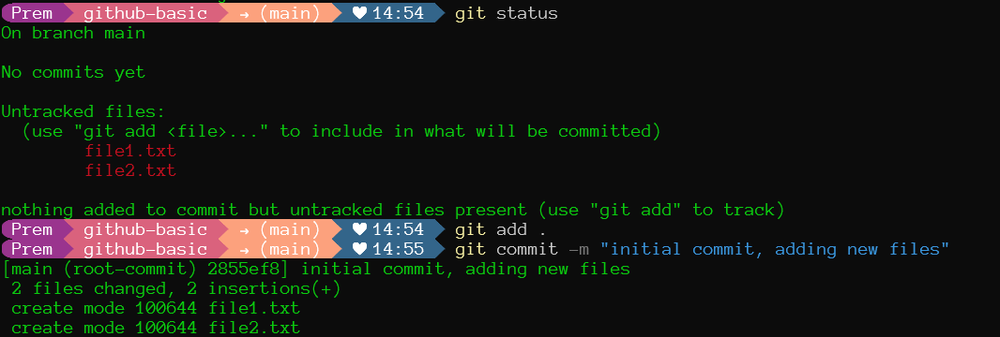

### Pushing the files to the master branch.
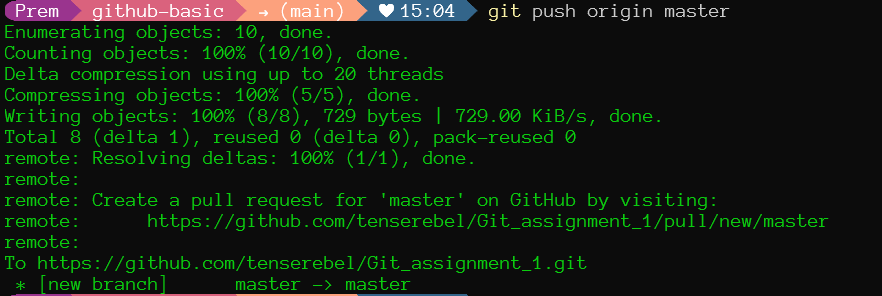

### Creating a New Branch and adding new files to it.
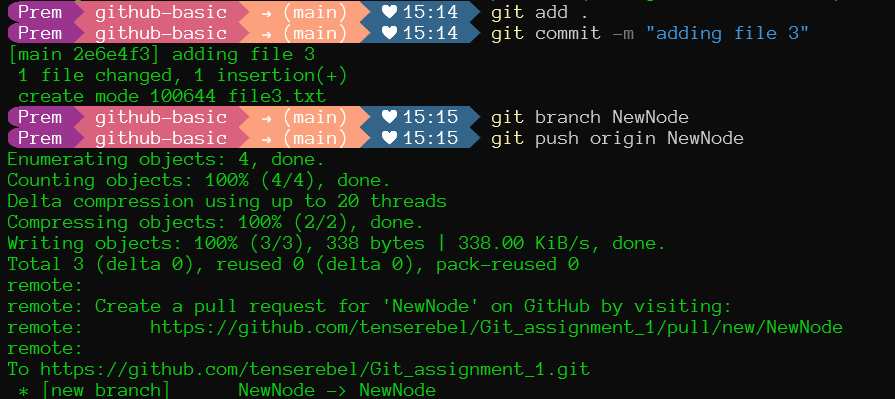

### Using stash.
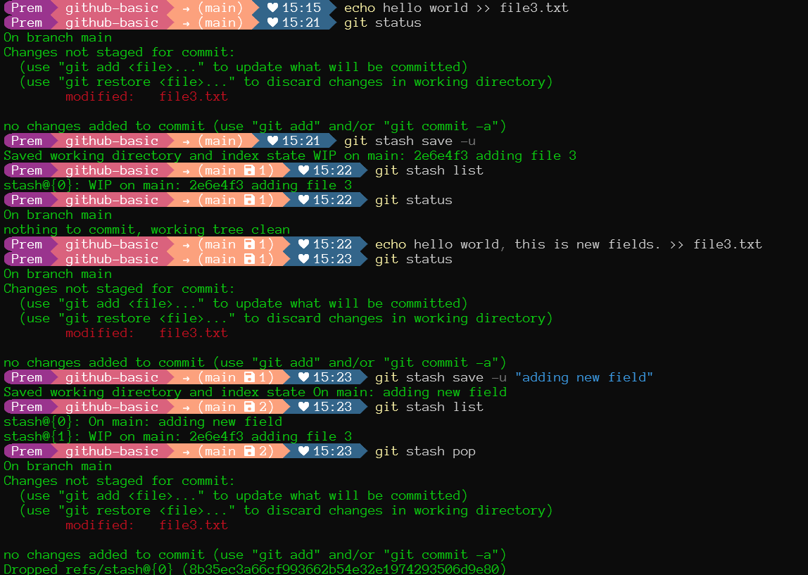

### Soft Reset.
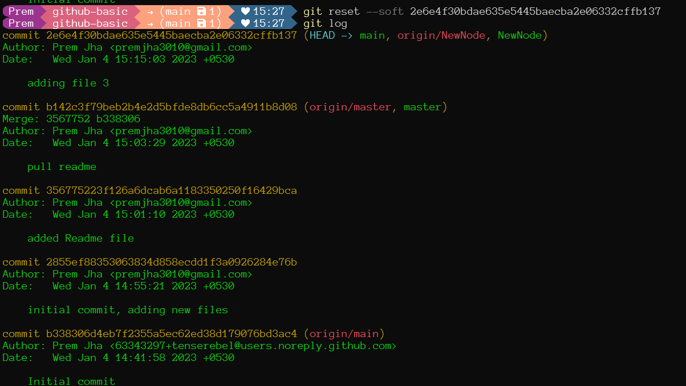

### Hard Reset.
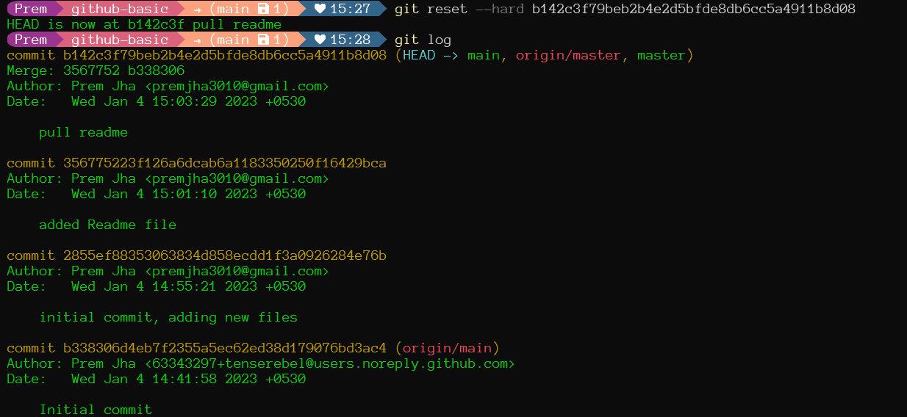

### Using diff.
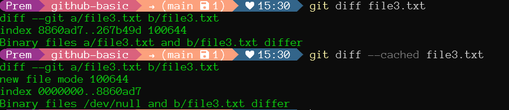

### Using checkout to switch branches. 
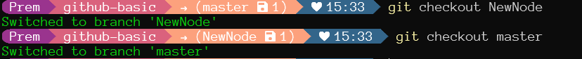

### Deleting a branch using -d and -D.
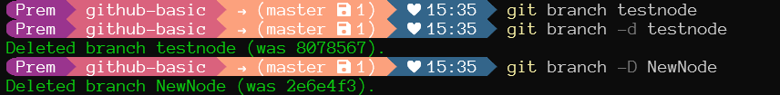

### Pushing branches to main.
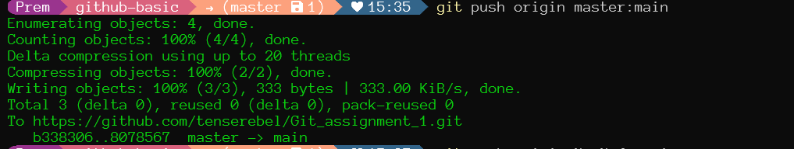

### Pulling data from the repo.
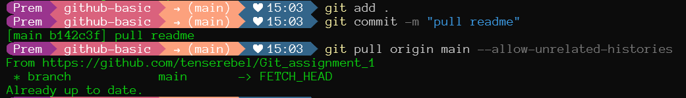

